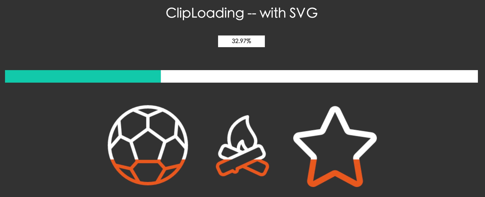
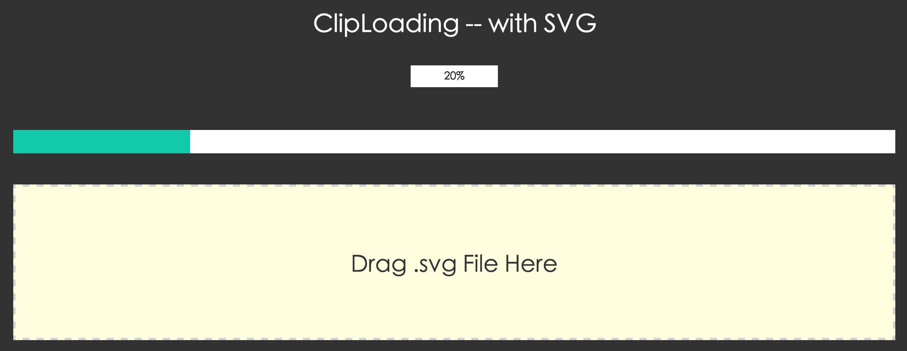

##ClipLoading
----------
> A loading progressBar based on canvas with DIY shape
> 外形可自定义的一个基于canvas的进度条
[https://justinzzc.github.io/ClipLoading](https://justinzzc.github.io/ClipLoading)

##用法

### 基本使用方法

~~~ html
<head>
      
</head>

<body>
...

 

...

</body>

~~~

##配置项

new  ClipLoading(element,options)

+ dom节点 element

+ 可用配置项 options

~~~ javascript
 /**
  *
  * -----------------------------------
  *
  * bgColor: 进度背景色
  *
  * frontColor: 进度色
  *
  *------------------------------------
  *
  * scale: 放大比例 0-1之间 ,如果不指定,则会根据width或者height来计算
  * (#如果scale/width/height都不配置,则默认scale是 1 #)
  *
  * width: 用于计算比例得宽度
  *
  * height: 用于计算比例得高度
  *
  * -----------------------------------
  *
  *  #自定义切割图形#
  *
  * clipWidth:切割图形原始宽度
  *
  * clipHeight:切割图形原始高度
  *
  * onClipDraw:自定义切割图形绘制方法 参数为(canvasContext,canvasSize{width,height},clipSize{width,height})
  *
  * onPercentDraw:自定义进度绘制方法 参数为(canvasContext,canvasSize{width,height},clipSize{width,height)
  *
  * -----------------------------------
  *
  * svg:切割图形svg文件的路径 (启用该参数的时候需要引入canvg2.js)
  *
  * -----------------------------------
  *
  * initPercent: 初始化进度 0-100之间
  *
  * rate:动画速率 0-1之间
  *
  * onPercentChange: 进度变化回调方法 ,参数为(currentPercent,lastPercent, isInAni)
  *
  * onComplete:进度完成100%回调方法
  *
  * -----------------------------------
  *
  *
  */
~~~

##实例方法

###render() 
刷新全局绘制

###renderPercent() 
刷新进度绘制

###setPercent(percent) 
设置进度 ,percent 进度值 0-100之间

###setAniPercent(percent) 
设置进度(动画缓进到指定进度) ,percent 进度值 0-100之间

###getPercent() 
获取当前进度  ,return 返回进度值

##例子Demo

详细请查看 

+ [demo页面](./demo/demo.html)
 - 
  
+ [demoSVG页面 - 导入svg绘图](./demo/demoSVG.html)
 -   
 
+ [demoSVG页面 - 拖拽测试](./demo/demoSVGDrag.html)
-  

> svg导入部分参考 [http://demo.qunee.com/svg2canvas/](http://demo.qunee.com/svg2canvas/) 赞!!

##捐赠donate

  