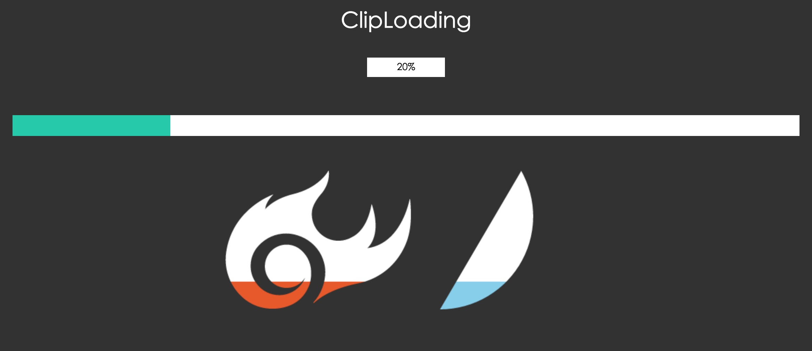

##ClipLoading
----------

A loading progressBar based on canvas with DIY shape 
外形可自定义的一个基于canvas的进度条

##用法

### 基本使用方法

~~~ html
<head>
      
</head>

<body>
...

 

...

</body>

~~~

##配置项

new  ClipLoading(element,options)

+ dom节点 element

+ 可用配置项 options

~~~ javascript
 /**
     *
     * -----------------------------------
     *
     * bgColor: 进度背景色
     *
     * frontColor: 进度色
     *
     *------------------------------------
     *
     * scale: 放大比例 0-1之间 ,如果不指定,则会根据width或者height来计算
     * (#如果scale/width/height都不配置,则默认scale是 1 #)
     *
     * width: 用于计算比例得宽度
     *
     * height: 用于计算比例得高度
     *
     * -----------------------------------
     *
     *  #自定义切割图形#
     *
     * clipWidth:切割图形原始宽度
     *
     * clipHeight:切割图形原始高度
     *
     * onClipDraw:自定义切割图形绘制方法 参数为(canvasContext,canvasSize{width,height},clipSize{width,height})
     *
     * onPercentDraw:自定义进度绘制方法 参数为(canvasContext,canvasSize{width,height},clipSize{width,height)
     *
     * -----------------------------------
     *
     * initPercent: 初始化进度 0-100之间
     *
     * rate:动画速率 0-1之间
     *
     * onPercentChange: 进度变化回调方法 ,参数为(currentPercent,lastPercent)
     *
     * onComplete:进度完成100%回调方法
     *
     * -----------------------------------
     *
     *
     * @type {*|{}}
     */
~~~

##例子Demo

详细请查看 [demo页面](./demo/demo.html)
  
